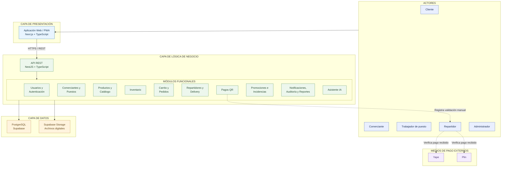

# Arquitectura Inicial del Sistema

## 1. Tipo de arquitectura

La Plataforma Integral Multivendedor para la Gestión Comercial y Operativa de un Mercado de Abastos utilizará una **arquitectura cliente-servidor de tres capas con enfoque modular**.

La solución se organizará en:

1. Capa de presentación
2. Capa de lógica de negocio
3. Capa de datos

Esta organización permitirá separar responsabilidades, facilitar el mantenimiento del sistema y permitir su crecimiento progresivo.

---

## 2. Capa de Presentación

La capa de presentación será responsable de la interacción entre los usuarios y el sistema.

### Tecnología

- Next.js
- TypeScript
- Aplicación Web/PWA

### Usuarios principales

- Cliente
- Comerciante
- Trabajador de puesto
- Repartidor
- Administrador

### Interfaces principales

- Marketplace
- Catálogo de productos
- Detalle de producto
- Carrito multivendedor
- Seguimiento de pedidos
- Selección de repartidor
- Pantalla de pago
- Panel del comerciante
- Panel del trabajador de puesto
- Panel del repartidor
- Panel del administrador

La capa de presentación se comunicará con la capa de lógica de negocio mediante una API REST.

---

## 3. Capa de Lógica de Negocio

La capa de lógica de negocio será responsable de procesar las reglas y operaciones principales de la plataforma.

### Tecnología

- NestJS
- TypeScript
- API REST

### Módulos principales

#### Autenticación y usuarios

Responsable del registro, inicio de sesión, gestión de perfiles, roles y permisos.

#### Comerciantes y puestos

Responsable de administrar comerciantes, puestos comerciales y tiendas virtuales.

#### Productos y categorías

Responsable del registro, actualización, disponibilidad y clasificación de productos.

#### Inventario

Responsable del control de stock físico, reservado y disponible, así como de los movimientos de inventario.

#### Marketplace y catálogo

Responsable de presentar los productos publicados por los diferentes puestos comerciales.

#### Carrito multivendedor

Responsable de permitir que el cliente agregue productos pertenecientes a diferentes puestos dentro del mismo carrito.

#### Pedidos

Responsable de generar y gestionar pedidos, agrupar productos por puesto y controlar sus diferentes estados.

#### Repartidores

Responsable del registro, verificación, disponibilidad y asignación de repartidores.

#### Pagos

Responsable del registro y validación de pagos realizados mediante Yape o Plin.

#### Delivery

Responsable del proceso de compra, consolidación, traslado y entrega de los pedidos.

#### Promociones

Responsable de administrar promociones y descuentos aplicables a productos o tiendas.

#### Incidencias

Responsable de gestionar cancelaciones, devoluciones, reclamos e incidencias.

#### Notificaciones

Responsable de informar a los usuarios sobre eventos importantes relacionados con pedidos y operaciones.

#### Auditoría

Responsable de registrar operaciones críticas y mantener la trazabilidad del sistema.

#### Inteligencia Artificial

Responsable de proporcionar asistencia en la búsqueda de productos sin afectar el funcionamiento principal de la plataforma.

#### Reportes

Responsable de generar indicadores, estadísticas y paneles de control para administradores, comerciantes y repartidores.

---

## 4. Capa de Datos

La capa de datos será responsable de almacenar y recuperar la información persistente del sistema.

### Tecnologías

- PostgreSQL
- Supabase
- Supabase Storage o Cloudflare R2

### Información almacenada

- Usuarios
- Roles y permisos
- Comerciantes
- Puestos
- Tiendas virtuales
- Productos
- Categorías
- Inventarios
- Movimientos de inventario
- Carritos
- Pedidos
- Historial de estados
- Repartidores
- Pagos registrados
- Entregas
- Incidencias
- Promociones
- Notificaciones
- Auditoría
- Reportes
- Documentos de verificación
- Imágenes de productos y tiendas

---

## 5. Sistemas externos

La plataforma podrá interactuar con sistemas o servicios externos.

### Yape

Utilizado como medio de pago mediante código QR.

### Plin

Utilizado como medio de pago mediante código QR.

### Supabase Storage / Cloudflare R2

Utilizados para almacenar imágenes, documentos de verificación, códigos QR y otras evidencias digitales.

---

## 6. Flujo general de comunicación

El flujo principal del sistema será:

Usuario → Aplicación Web/PWA → API REST → Módulos de negocio → Base de datos

Los servicios externos podrán ser utilizados por determinados módulos cuando sea necesario.

Ejemplo:

Cliente → Web/PWA → API REST → Pedidos → Repartidores → Pagos → Delivery → Base de datos

## 7. Diagrama de Arquitectura

La solución se organiza mediante una arquitectura cliente-servidor de tres capas con enfoque modular.

El siguiente diagrama representa la estructura general del sistema, sus actores, los principales módulos de negocio y los servicios de persistencia.

## 8. Justificación de la arquitectura

### Arquitectura cliente-servidor

La plataforma utilizará un modelo cliente-servidor, donde los usuarios accederán mediante una aplicación Web/PWA y las operaciones principales serán procesadas por el backend.

### Arquitectura en tres capas

**Presentación:** proporciona interfaces para clientes, comerciantes, trabajadores de puesto, repartidores y administradores.

**Lógica de negocio:** implementa los módulos funcionales del sistema mediante NestJS y expone sus operaciones a través de una API REST.

**Datos:** almacena información estructurada en PostgreSQL y archivos digitales mediante servicios de almacenamiento.

### Enfoque modular

Los módulos funcionales tendrán responsabilidades definidas, permitiendo organizar el sistema y facilitar su evolución.

### Pagos externos

Los pagos se realizarán directamente entre el cliente y el repartidor mediante Yape o Plin.

La plataforma no procesará transferencias bancarias mediante API.

El repartidor verificará el pago recibido y registrará su validación dentro del sistema.

### Evolución hacia Clean Architecture

La arquitectura inicial establece la separación global de responsabilidades.

En la siguiente etapa se aplicará Clean Architecture para definir la organización interna de los módulos y orientar las dependencias hacia las reglas del negocio.

El diagrama presentado es una vista conceptual de los componentes. Las conexiones hacia la capa de datos representan acceso a persistencia y no implican que las reglas de negocio dependan directamente de PostgreSQL.
