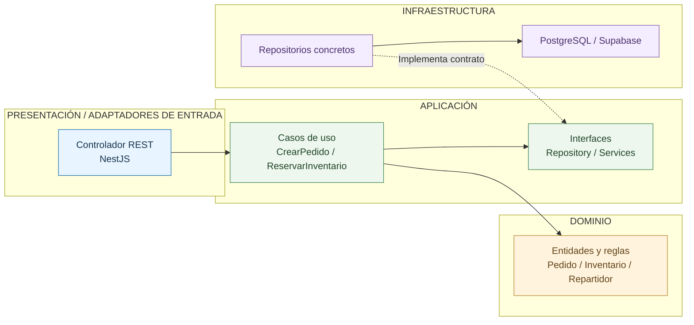

# Enfoque Arquitectónico: Clean Architecture

## 1. Información general

| Campo | Descripción |
|---|---|
| Proyecto | Plataforma Integral Multivendedor para la Gestión Comercial y Operativa de un Mercado de Abastos |
| Enfoque seleccionado | Clean Architecture |
| Estilo global | Cliente-servidor de tres capas |
| Organización del backend | Monolito modular |
| Tecnología backend | NestJS + TypeScript |
| Tecnología frontend | Next.js + TypeScript |
| Driver principal | DA14 - Mantenibilidad y evolución modular |
| Decisión relacionada | ADR-002 - Clean Architecture |
| Estado | Arquitectura propuesta |

## 2. Contexto

La plataforma integrará múltiples procesos comerciales y operativos de un mercado de abastos.

Entre sus funcionalidades se encuentran la gestión de comerciantes y puestos, productos, inventarios, pedidos multivendedor, repartidores, pagos mediante QR y entregas.

Estas funcionalidades necesitan reglas de negocio independientes de los frameworks y servicios tecnológicos empleados.

Para facilitar su mantenimiento, evolución y pruebas se propone aplicar Clean Architecture dentro de los módulos del backend.

## 3. Enfoque arquitectónico seleccionado

Se selecciona Clean Architecture como enfoque para organizar las responsabilidades internas del sistema.

Su principal objetivo es proteger las reglas del negocio de los cambios tecnológicos.

Las dependencias del código deberán orientarse hacia las capas internas, evitando que el dominio dependa directamente de NestJS, PostgreSQL, Supabase u otros servicios externos.

El enfoque complementa al estilo cliente-servidor de tres capas y a la organización mediante monolito modular.

## 4. Capas de Clean Architecture

### 4.1. Dominio (Domain)

Contiene las entidades, objetos de valor y reglas fundamentales del negocio.

**Responsabilidades:**

- Definir las entidades del sistema.
- Aplicar reglas de negocio.
- Validar invariantes del dominio.
- Controlar transiciones permitidas.
- Proteger las condiciones fundamentales de inventario y pedidos.

**Ejemplos:**

- Pedido.
- Producto.
- Inventario.
- Repartidor.
- Pago.
- ReservaInventario.
- ReservaRepartidor.

El dominio no dependerá directamente de frameworks, controladores HTTP ni repositorios concretos.

### 4.2. Aplicación (Application)

Contiene los casos de uso encargados de coordinar las operaciones del sistema.

**Responsabilidades:**

- Ejecutar casos de uso.
- Coordinar entidades del dominio.
- Definir interfaces de repositorios.
- Establecer contratos para servicios externos.
- Coordinar transacciones mediante abstracciones.

**Ejemplos de casos de uso:**

- CrearPedido.
- ReservarInventario.
- SeleccionarRepartidor.
- ValidarPago.
- RegistrarCompra.
- ConfirmarEntrega.

La aplicación dependerá del dominio y de interfaces, pero no directamente de implementaciones concretas de PostgreSQL.

### 4.3. Presentación y adaptadores de entrada

Permite recibir solicitudes y entregar respuestas a los usuarios.

**Responsabilidades:**

- Recibir solicitudes HTTP.
- Validar estructuras de entrada.
- Ejecutar casos de uso.
- Transformar respuestas.
- Gestionar códigos y errores HTTP.

**Elementos:**

- Controladores REST.
- DTO de entrada y salida.
- Validadores.
- Adaptadores de presentación.

En el backend se utilizarán controladores NestJS.

La aplicación Next.js actuará como cliente de la API REST.

### 4.4. Infraestructura (Infrastructure)

Contiene implementaciones concretas de persistencia e integración tecnológica.

**Responsabilidades:**

- Implementar interfaces de repositorios.
- Acceder a PostgreSQL.
- Gestionar almacenamiento de archivos.
- Implementar servicios de notificaciones.
- Integrar servicios externos.
- Configurar proveedores y frameworks.

**Elementos:**

- PostgreSQL.
- Supabase.
- Supabase Storage.
- Repositorios concretos.
- Adaptadores externos.

La infraestructura implementará los contratos definidos por las capas internas.

## 5. Diagrama de Clean Architecture

El siguiente diagrama representa las dependencias del código dentro de un módulo del backend.

Las flechas indican la dirección de las dependencias hacia las capas internas.



**Nota:** El diagrama representa dependencias del código y relaciones de implementación. El acceso a la base de datos ocurre en tiempo de ejecución a través de los repositorios concretos; el dominio no depende directamente de PostgreSQL.

## 6. Regla de dependencias

La regla fundamental establece que las dependencias del código deben apuntar hacia las capas internas.

| Componente | Puede depender de | No debe depender directamente de |
|---|---|---|
| Dominio | Elementos internos del dominio | NestJS, PostgreSQL, Next.js, infraestructura |
| Aplicación | Dominio e interfaces propias | Repositorios concretos, controladores HTTP |
| Presentación | Casos de uso y contratos de entrada/salida | Detalles concretos de persistencia |
| Infraestructura | Contratos de aplicación y tipos del dominio | Controladores de presentación para implementar reglas de negocio |

La conexión entre interfaces e implementaciones se resolverá mediante inyección de dependencias.

## 7. Ejemplo aplicado: creación de pedido multivendedor

### Presentación

El cliente confirma un carrito que contiene productos de diferentes puestos.

El controlador REST recibe la solicitud y delega la operación al caso de uso correspondiente.

### Aplicación

El caso de uso `CrearPedido` coordina:

1. Validación del carrito.
2. Verificación de disponibilidad.
3. Reserva de inventario.
4. Creación del pedido principal.
5. Agrupación de productos por puesto.
6. Registro inicial del estado del pedido.

### Dominio

El dominio aplica las reglas necesarias para:

- Impedir cantidades inválidas.
- Mantener la relación entre productos y puestos.
- Controlar la estructura del pedido.
- Aplicar las reglas de transición de estados.

### Infraestructura

Los repositorios concretos ejecutan las operaciones necesarias sobre PostgreSQL.

Las operaciones críticas se realizarán mediante mecanismos transaccionales para evitar inconsistencias.

## 8. Ejemplo aplicado: selección de repartidor

### Presentación

El cliente selecciona un repartidor disponible desde la aplicación Web/PWA.

### Aplicación

El caso de uso `SeleccionarRepartidor` coordina la solicitud de reserva temporal.

### Dominio

Se validan reglas como:

- El repartidor debe estar verificado.
- Debe encontrarse habilitado.
- No debe tener una reserva incompatible.
- La solicitud debe respetar las condiciones de disponibilidad.

### Infraestructura

El repositorio de repartidores realiza la operación de reserva mediante transacciones o actualizaciones condicionales de PostgreSQL.

Esto evita que dos solicitudes incompatibles reserven simultáneamente al mismo repartidor.

## 9. Estructura de carpetas propuesta

La siguiente estructura es referencial para el desarrollo posterior del backend NestJS.

```text
src/
├── modules/
│   ├── pedidos/
│   │   ├── domain/
│   │   │   ├── entities/
│   │   │   └── value-objects/
│   │   ├── application/
│   │   │   ├── use-cases/
│   │   │   └── ports/
│   │   ├── infrastructure/
│   │   │   └── persistence/
│   │   └── presentation/
│   │       └── controllers/
│   ├── inventario/
│   ├── repartidores/
│   ├── pagos/
│   ├── comerciantes/
│   └── productos/
├── shared/
└── main.ts
```

Los demás módulos podrán utilizar una organización equivalente, ajustada a sus responsabilidades.

Esta estructura no implica que las carpetas ya estén implementadas.

## 10. Relación con los drivers arquitectónicos

| Driver | Respuesta arquitectónica |
|---|---|
| DA04 - Seguridad | Separación de políticas de negocio y mecanismos técnicos de autenticación. |
| DA05 - Escalabilidad y modularidad | Módulos organizados mediante contratos y responsabilidades definidas. |
| DA06 - API REST | Controladores REST como adaptadores de entrada. |
| DA13 - Aislamiento de fallos | Integraciones externas desacopladas mediante interfaces. |
| DA14 - Mantenibilidad | Dependencias dirigidas hacia las reglas del negocio. |

## 11. Beneficios esperados

- Separación de responsabilidades.
- Menor acoplamiento entre reglas de negocio y tecnologías externas.
- Facilidad para realizar pruebas unitarias.
- Evolución independiente de implementaciones de infraestructura.
- Mejor organización de casos de uso.
- Mayor claridad de los límites entre módulos.

## 12. Limitaciones y consideraciones

- Se incrementa la cantidad de clases, interfaces y archivos.
- Requiere comprender correctamente la regla de dependencias.
- Puede generar complejidad innecesaria si se aplica excesivamente a funcionalidades simples.
- No garantiza por sí sola seguridad, rendimiento o escalabilidad.
- Debe complementarse con transacciones, autorización, observabilidad y pruebas.

## 13. Justificación de la selección

Clean Architecture se selecciona principalmente para responder al driver DA14, relacionado con la mantenibilidad y evolución modular.

Este enfoque permitirá preservar las reglas de negocio de inventario, pedidos, repartidores y pagos frente a cambios tecnológicos.

Su aplicación contribuirá a mantener una estructura comprensible y preparada para evolucionar durante el desarrollo de la plataforma.

## 14. Relación con otros documentos

- [Arquitectura inicial](../arquitectura-inicial.md)
- [Estilo arquitectónico](../estilo-arquitectonico.md)
- [ADR-001: Monolito modular](../decisiones/ADR-001-monolito-modular.md)
- [ADR-002: Clean Architecture](../decisiones/ADR-002-clean-architecture.md)
- [ADR-003: Control de concurrencia](../decisiones/ADR-003-control-concurrencia.md)
- [ADR-004: Pagos mediante QR](../decisiones/ADR-004-pagos-qr.md)
