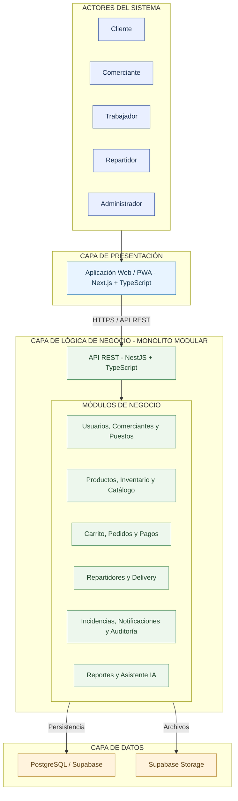

# Estilo Arquitectónico del Sistema

## 1. Información general

| Campo | Descripción |
|---|---|
| Proyecto | Plataforma Integral Multivendedor para la Gestión Comercial y Operativa de un Mercado de Abastos |
| Documento | Definición del estilo arquitectónico |
| Estilo principal | Cliente-servidor de tres capas |
| Organización del backend | Monolito modular |
| Enfoque interno | Clean Architecture |
| Tecnologías | Next.js, TypeScript, NestJS, PostgreSQL y Supabase |
| Estado | Arquitectura propuesta |
| Fecha | 08/10/2026 |

## 2. Contexto arquitectónico

La plataforma permitirá integrar los procesos comerciales y operativos de un mercado de abastos mediante una aplicación web multivendedor.

Los clientes podrán consultar productos de distintos puestos, crear pedidos y seleccionar repartidores.

Los comerciantes administrarán sus productos e inventarios de manera independiente, mientras que los repartidores realizarán las compras y entregas correspondientes.

Debido a la participación de diferentes actores y a la necesidad de mantener consistencia en las operaciones de inventario, pedidos y asignación de repartidores, se requiere una arquitectura que separe las responsabilidades del sistema.

## 3. Estilo arquitectónico seleccionado

Se selecciona una arquitectura cliente-servidor de tres capas, con un backend organizado como monolito modular.

### 3.1. Capa de presentación

**Tecnologías:**

- Next.js.
- TypeScript.
- Aplicación Web/PWA.

**Responsabilidades:**

- Presentar el marketplace y catálogo.
- Gestionar las interfaces de los clientes.
- Permitir la administración de comerciantes y puestos.
- Mostrar el carrito y los pedidos.
- Presentar la selección de repartidores.
- Mostrar códigos QR para pagos externos.
- Permitir el seguimiento de pedidos.
- Proporcionar paneles administrativos.

La comunicación con el backend se realizará mediante HTTPS y API REST.

### 3.2. Capa de lógica de negocio

**Tecnologías:**

- NestJS.
- TypeScript.
- API REST.

La lógica de negocio estará organizada mediante un monolito modular.

| Grupo funcional | Módulos |
|---|---|
| Identidad y administración | Autenticación, usuarios, comerciantes, puestos y tiendas |
| Gestión comercial | Productos, categorías, inventario, promociones y catálogo |
| Proceso de compra | Carrito multivendedor, pedidos y pagos |
| Operaciones de entrega | Repartidores y delivery |
| Servicios transversales | Notificaciones, incidencias, auditoría e inteligencia artificial |
| Explotación de información | Reportes e indicadores |

Cada módulo tendrá responsabilidades definidas y deberá mantener contratos claros para sus interacciones.

El backend se desplegará inicialmente como una única aplicación.

### 3.3. Capa de datos

**Tecnologías:**

- PostgreSQL.
- Supabase.
- Supabase Storage.

**Responsabilidades:**

- Almacenar usuarios, roles y permisos.
- Gestionar comerciantes, puestos y tiendas virtuales.
- Mantener productos, categorías e inventarios.
- Registrar carritos, pedidos y reservas.
- Almacenar información de repartidores.
- Conservar pagos registrados y entregas.
- Mantener auditoría e incidencias.
- Almacenar referencias a archivos digitales.

PostgreSQL será la fuente principal de persistencia para la información estructurada.

Supabase Storage se utilizará inicialmente para archivos digitales. Cloudflare R2 se mantendrá como alternativa futura.

## 4. Diagrama del estilo arquitectónico

El siguiente diagrama representa las tres capas del sistema y la organización modular del backend.

Los módulos están agrupados por responsabilidad para facilitar la lectura.

**Nota:** Las conexiones del diagrama representan relaciones funcionales entre componentes. No implican dependencias directas de las reglas de negocio hacia la base de datos.

La organización interna de las dependencias se especificará en el documento de Clean Architecture.

## 5. Relaciones entre componentes

| Origen | Destino | Comunicación |
|---|---|---|
| Usuarios | Aplicación Web/PWA | Interacción mediante navegador |
| Web/PWA | Backend NestJS | HTTPS / API REST |
| API REST | Módulos funcionales | Invocación de casos de uso |
| Módulos funcionales | PostgreSQL | Persistencia mediante repositorios y adaptadores |
| Módulos funcionales | Supabase Storage | Almacenamiento mediante adaptadores |
| Cliente | Yape / Plin | Pago externo mediante aplicación móvil |
| Repartidor | Yape / Plin | Verificación del dinero recibido |

Los pagos mediante Yape o Plin no constituyen una integración bancaria automatizada.

## 6. Justificación de la arquitectura

### 6.1. Separación de responsabilidades

La arquitectura en tres capas permite distinguir la interacción con los usuarios, la ejecución de las operaciones de negocio y la persistencia.

### 6.2. Mantenibilidad

El monolito modular permite organizar las funcionalidades en módulos definidos.

Clean Architecture complementará esta decisión controlando las dependencias internas.

### 6.3. Consistencia transaccional

El backend centralizado permite coordinar operaciones críticas mediante PostgreSQL.

Esto resulta relevante para evitar reservas incompatibles de inventario y repartidores.

### 6.4. Escalabilidad progresiva

La plataforma podrá evolucionar mediante optimización de consultas, incorporación de caché y, cuando sea necesario, escalamiento de instancias del backend.

La separación modular permitirá evaluar futuras extracciones de servicios independientes.

### 6.5. Seguridad

La arquitectura permitirá centralizar autenticación, autorización y validaciones de operaciones críticas en el backend.

Los permisos deberán verificarse para cada operación y recurso protegido.

## 7. Alternativas evaluadas

| Alternativa | Evaluación |
|---|---|
| Cliente-servidor de tres capas | Seleccionada para separar presentación, negocio y persistencia. |
| Monolito tradicional sin modularidad | Descartado por el riesgo de generar alto acoplamiento entre funcionalidades. |
| Microservicios desde la primera versión | No seleccionados debido a la complejidad adicional de despliegue, comunicación y consistencia distribuida. |
| Monolito modular | Seleccionado para organizar el backend mediante módulos con responsabilidades claras. |

La elección del monolito modular no impide que determinados componentes puedan independizarse posteriormente, si los requisitos operativos lo justifican.

## 8. Drivers arquitectónicos relacionados

| Driver | Respuesta arquitectónica |
|---|---|
| DA02 - Consistencia del inventario | Coordinación de operaciones transaccionales mediante PostgreSQL. |
| DA03 - Control concurrente de repartidores | Reservas consistentes y exclusivas cuando corresponda. |
| DA04 - Seguridad de la información | Autenticación y autorización centralizadas. |
| DA05 - Escalabilidad y modularidad | Monolito modular con evolución progresiva. |
| DA06 - API REST | Comunicación HTTP entre frontend y backend. |
| DA08 - Pedidos multivendedor | Módulos de carrito, pedidos e inventario coordinados. |
| DA14 - Mantenibilidad | Separación modular y aplicación de Clean Architecture. |
| DA16 - Arquitectura de tres capas | Separación global de presentación, negocio y datos. |

## 9. Consecuencias arquitectónicas

### Consecuencias positivas

- Separación clara de responsabilidades.
- Organización modular del backend.
- Despliegue inicial relativamente sencillo.
- Mayor facilidad para realizar pruebas de integración.
- Coordinación transaccional de operaciones críticas.
- Posibilidad de crecimiento progresivo.

### Consecuencias negativas

- Los módulos del backend comparten inicialmente un proceso de ejecución.
- El despliegue de cambios del backend se realiza conjuntamente.
- La escalabilidad individual de cada módulo no está disponible inicialmente.
- Será necesario controlar las dependencias entre módulos.

## 10. Relación con otros documentos

- [Arquitectura inicial](arquitectura-inicial.md)
- [ADR-001: Monolito modular](decisiones/ADR-001-monolito-modular.md)
- [ADR-002: Clean Architecture](decisiones/ADR-002-clean-architecture.md)
- [ADR-003: Control de concurrencia](decisiones/ADR-003-control-concurrencia.md)
- [ADR-004: Pagos mediante QR](decisiones/ADR-004-pagos-qr.md)
- [Enfoque arquitectónico](enfoque/enfoque-arquitectonico.md)
